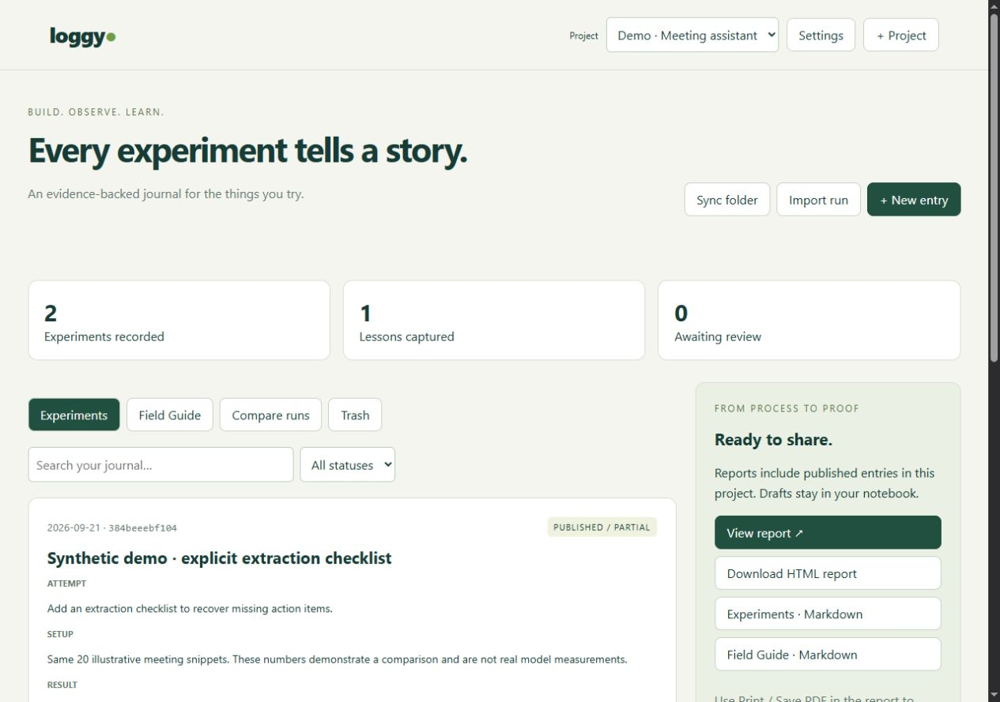

# Loggy

**Turn experiment results into an evidence-backed project history—and a report you can share.**

Loggy is a local-first experiment journal for AI builders, capstone students, and anyone
iterating on a project. Import benchmark results, compare runs, record what happened,
and connect your lessons to the experiments that support them.

No account. No API key. No runtime dependencies. Python 3.10+ on Windows, macOS, or Linux.



## Install and launch

Download the wheel from [GitHub Releases](https://github.com/moul1k/Loggy/releases), then:

```sh
python -m pip install loggy_journal-0.1.0-py3-none-any.whl
loggy --open
```

Or install directly from the release tag (requires Git):

```sh
python -m pip install "git+https://github.com/moul1k/Loggy.git@v0.1.0"
loggy --open
```

If your shell cannot find `loggy`, use `python -m loggy --open`. The app opens at
http://127.0.0.1:8765. Keep the terminal running; Ctrl+C stops it. There is no PyPI
release yet—use the wheel or repository URL above, not `pip install loggy`.

## Your first five minutes

1. Click **Explore demo project** to load two clearly labeled synthetic experiments
   and a linked learning. The sample includes a quality/latency tradeoff.
2. Open **Compare runs** and compare the baseline with the candidate. See metric
   deltas and model, prompt, dataset, and commit changes.
3. Click **+ Project**, give it a name, and optionally paste a local results-folder path.
4. Click **Import run** to upload your JSON. **Get example JSON** provides a template;
   the [run format guide](docs/run-format.md) documents every field.
5. Review the imported draft, record your next step, and publish it. Add a learning
   with supporting experiment IDs. Published learnings require published experiments.
6. **View report** or download HTML/Markdown. The report's Print button lets your
   browser save a PDF. Review private details before sharing.

## What it does

- Keeps an **Experiments Log**: date, attempt, setup, result, outcome, next step.
- Keeps a **Learnings Field Guide**: date, general lesson, explanation, evidence links.
- Imports generic Loggy JSON and `meeting-eval` benchmark artifacts.
- Compares metrics using explicit higher/lower/unknown directions. Unknown directions
  remain unclassified. Missing measurements are not treated as zero.
- Shows caveats for fixture runs and changed or missing dataset identities.
- Stores imported measurements and source checksums independently of editable prose.
- Saves prior revisions, detects stale edits, and offers recoverable trash.
- Backs up all projects and restores them into separate projects without overwriting work.

Loggy's agent is deterministic: it watches files, records measurements, and prepares
drafts for review. It does not invent lessons, perform statistical significance tests,
or call an LLM. A fixture benchmark validates a harness, not real-model performance.

## Connect a results folder

Use **Settings** to set a project's folder. Loggy checks its `artifacts/runs` child if
present; otherwise it scans that folder's top-level `*.json` files. Choose a dedicated
results folder to avoid unrelated JSON. Sync is manual unless you start with:

```sh
loggy --watch --open
```

All configured projects are checked every 30 seconds while the process is running.
Identical file contents are imported only once per project, even after an entry is
edited or moved to trash. Modified files become new drafts. Malformed files are reported
and do not block other imports. Run uploads are limited to 5 MB.

For the original transcription project:

```sh
python -m loggy --project "../99p_transcription_agent 2" --watch --open
```

## Data, backups, and upgrades

New installations store data at `~/.loggy/loggy.db`. If `.loggy/loggy.db` exists in the
current directory, Loggy uses it for compatibility with the initial version. Use an
explicit `--db` path if you work from several directories. SQLite stores projects,
entries, import checksums, edit history, and trash.

The initial schema migrates automatically and creates `loggy.pre-v01.db` alongside
the original first. Stop the old Loggy process before upgrading. Older entries remain
intact; those created by the initial importer have no structured comparison metrics.
For comparisons, import their original runs into a new project.

**Back up all projects** downloads a versioned JSON backup. **Restore a backup** previews
the counts, validates the data, and restores it atomically to separate projects with new
IDs. Experiment references and import checksums are preserved. Folder paths are reset
to prevent a restored backup from silently reading local files. Current backups support
up to 15 MB through the UI. Initial-version entry-only JSON exports cannot be restored
through this workflow. For larger datasets, stop Loggy and copy the SQLite file.

Reports contain published entries only. Backups contain **drafts, trash, history, and
folder paths**; keep them private. See [SECURITY.md](SECURITY.md).

## CLI

```sh
loggy --version
loggy --port 8766 --db /path/to/loggy.db --open
loggy sync --project /path/to/results
loggy export --project-id PROJECT_ID --output output
```

The default project ID is `default`; other IDs appear in the report URL's `project`
parameter. Export writes two Markdown documents, a standalone HTML report, and a full
backup. No external fonts, scripts, or network calls are needed to view the report.

## Development

```sh
git clone https://github.com/moul1k/Loggy.git
cd Loggy
python -m pip install -e .
python -m unittest discover -s tests -v
python -m loggy --db .loggy/dev.db --open
```

See [CONTRIBUTING.md](CONTRIBUTING.md). CI tests Python 3.10 and 3.13 on Windows and
Linux, including installation and packaged assets. Release tags publish a wheel and
source distribution after the test matrix passes. macOS uses the same Python code but
is not currently in the automated test matrix.

## Scope of v0.1

This is a local, single-user beta, not a public web service. There is no authentication,
hosted sharing, team collaboration, LLM summarization, or background service after you
close Loggy. Do not expose the local server publicly. Those features need additional
product and security work before being offered.

MIT licensed. Built and maintained in [moul1k/Loggy](https://github.com/moul1k/Loggy).
